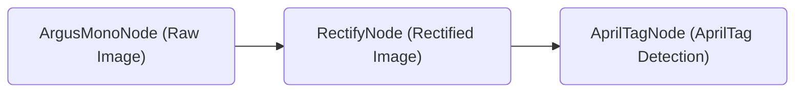

# Tutorial to Run NITROS-Accelerated Graph with Argus Camera



If you have an [Argus-compatible camera](https://github.com/NVIDIA-ISAAC-ROS/isaac_ros_argus_camera), you can also use the launch file provided in this package to start a fully NITROS-accelerated AprilTag graph.

To start the graph, follow the steps below:

1. Follow the [Quickstart section](../README.md#quickstart) up to step 2 in the main README.
   
2. Clone additional repositories required to run Argus-compatible camera under `~/workspaces/isaac_ros-dev/src`.

    ```bash
    cd ~/workspaces/isaac_ros-dev/src
    ```

    ```bash
    git clone https://github.com/NVIDIA-ISAAC-ROS/isaac_ros_argus_camera
    ```

    ```bash
    git clone https://github.com/NVIDIA-ISAAC-ROS/isaac_ros_image_pipeline
    ```

3. Launch the Docker container using the `run_dev.sh` script:
    ```bash
    cd ~/workspaces/isaac_ros-dev/src/isaac_ros_common && \
      ./scripts/run_dev.sh
    ```

4.  Inside the container, build and source the workspace:
    ```bash
    cd /workspaces/isaac_ros-dev && \
      colcon build --symlink-install && \
      source install/setup.bash
    ```
5.  (Optional) Run tests to verify complete and correct installation:
    ```bash
    colcon test
    ```

6. Run the following launch files to start the graph:
    ```bash
    ros2 launch isaac_ros_apriltag isaac_ros_argus_apriltag_pipeline.launch.py
    ```

7. Open a **second** terminal inside the docker container:
    ```bash
    cd ~/workspaces/isaac_ros-dev/src/isaac_ros_common && \
      ./scripts/run_dev.sh
    ```
8. Observe the AprilTag detection output `/tag_detections` on a separate terminal with the command:   
    ```bash
    source install/setup.bash && \
    ros2 topic echo /tag_detections
    ```